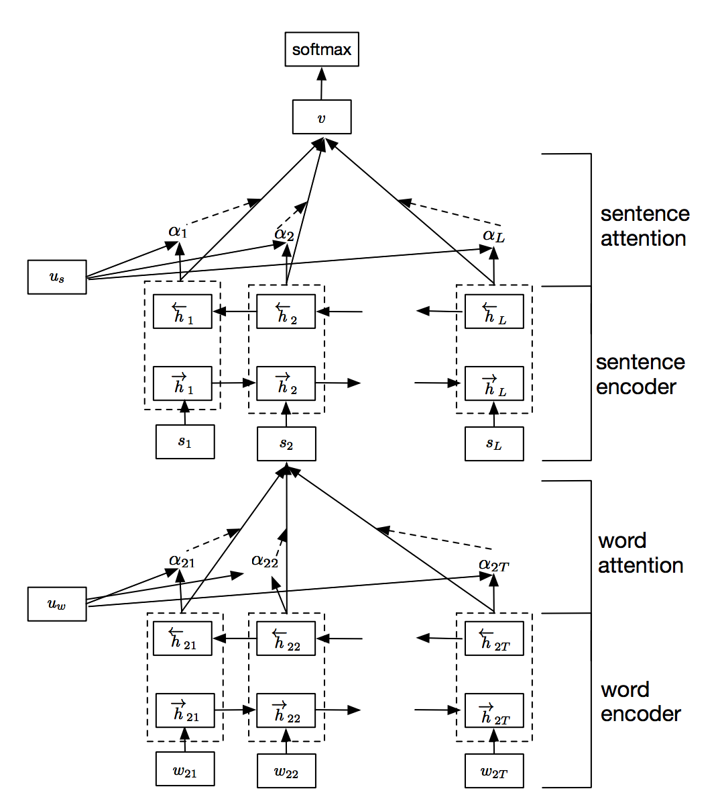

# HierarchicalAttentionNetworks

This repository contains an implementation of [Hierarchical Attention Networks for Document Classification](https://www.cs.cmu.edu/~diyiy/docs/naacl16.pdf)

Hierarchical Attention Networks  consists of the following  parts:

1. Embedding layer
2. Word Encoder: word level bi-directional GRU to get rich representation of words
3. Word Attention:word level attention to get important information in a sentence
4. Sentence Encoder: sentence level bi-directional GRU to get rich representation of sentences
5. Sentence Attention: sentence level attention to get important sentence among sentences
6. Fully Connected layer + Softmax

These models have 2 levels of attention: one at the word level and one at the sentence level thereby allowing the model to pay less or more attention to individual words and sentences accordingly when constructing the represenation of a document.

## DataSet:
I have used the IMDB Movies dataset from Kaggle, labeledTrainData.tsv which contains 25000 reviews with labels

### Preprocessing on the Data:
I have done minimal preprocessing on the input reviews in the dataset following these basic steps:

Remove html tags
Replace non-ascii characters with a single space
Split each review into sentences
Then I create the character set with a max sentence length of 512 chars and set an upper bound of 15 for the max number of sentences per review. The input X is indexed as (document, sentence, char) and the target y has the corresponding sentiments.

## Requirements:
pandas 0.20.3
tensorflow 1.4.0
keras 2.0.8
numpy 1.14.0

## Execution:
python HierarchicalAttn.py
