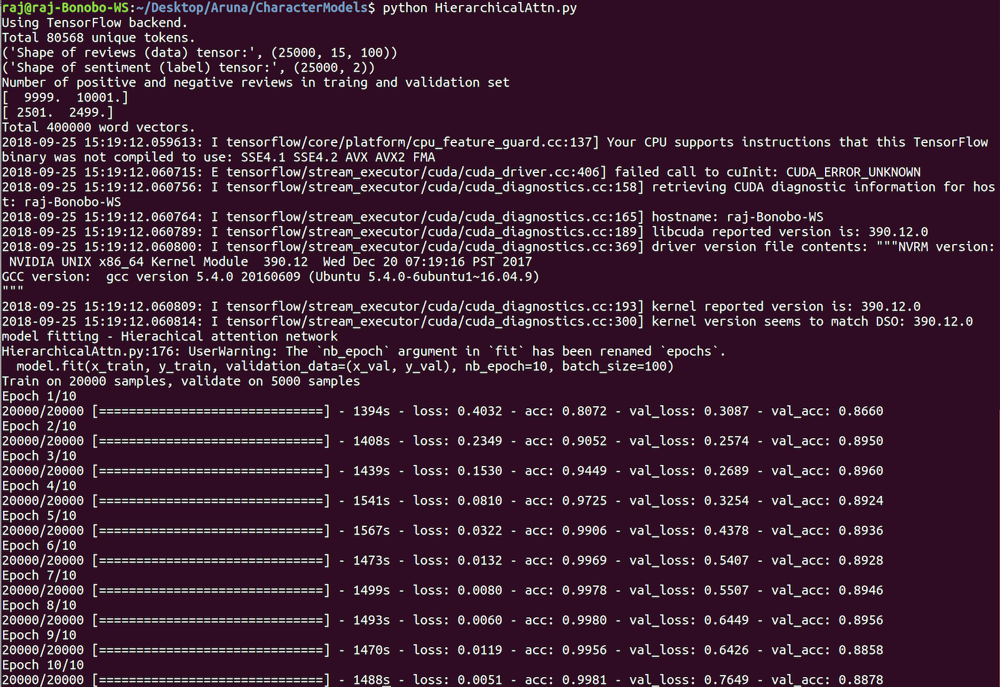

# HierarchicalAttentionNetworks with Keras

This repository contains an implementation of [Hierarchical Attention Networks for Document Classification](https://www.cs.cmu.edu/~diyiy/docs/naacl16.pdf)

**Hierarchical Attention Networks**  consists of the following  parts:

1. Embedding layer
2. Word Encoder: word level bi-directional GRU to get rich representation of words
3. Word Attention:word level attention to get important information in a sentence
4. Sentence Encoder: sentence level bi-directional GRU to get rich representation of sentences
5. Sentence Attention: sentence level attention to get important sentence among sentences
6. Fully Connected layer + Softmax

These models have 2 levels of attention: one at the word level and one at the sentence level thereby allowing the model to pay less or more attention to individual words and sentences accordingly when constructing the represenation of a document.

## DataSet:
I have used the [IMDB Movies dataset from Kaggle](https://www.kaggle.com/c/word2vec-nlp-tutorial/data), labeledTrainData.tsv which contains 25000 reviews with labels

### Preprocessing on the Data:
I have done minimal preprocessing on the input reviews in the dataset following these basic steps:

1. Remove html tags

2. Replace non-ascii characters with a single space

3. Split each review into sentences

Then I create the character set with a max sentence length of 512 chars and set an upper bound of 15 for the max number of sentences per review. The input X is indexed as (document, sentence, char) and the target y has the corresponding sentiments.

## Attention Layer Implementation
Attention mechanism layer which reduces RNN/Bi-RNN outputs with Attention vector (adapted from the paper).
        inputs: The Attention inputs.       
            Matches outputs of RNN/Bi-RNN layer (not final state):            
                In case of RNN, this must be RNN outputs `Tensor`:
                    If time_major == False (default), this must be a tensor of shape:
                        `[batch_size, max_time, cell.output_size]`.
                    If time_major == True, this must be a tensor of shape:
                        `[max_time, batch_size, cell.output_size]`.
                In case of Bidirectional RNN, this must be a tuple (outputs_fw, outputs_bw) containing the forward and
                the backward RNN outputs `Tensor`.
                    If time_major == False (default),
                        outputs_fw is a `Tensor` shaped:
                        `[batch_size, max_time, cell_fw.output_size]`
                        and outputs_bw is a `Tensor` shaped:
                        `[batch_size, max_time, cell_bw.output_size]`.
                    If time_major == True,
                        outputs_fw is a `Tensor` shaped:
                        `[max_time, batch_size, cell_fw.output_size]`
                        and outputs_bw is a `Tensor` shaped:
                        `[max_time, batch_size, cell_bw.output_size]`.
        attention_size: Linear size of the Attention weights.
        time_major: The shape format of the `inputs` Tensors.
            If true, these `Tensors` must be shaped `[max_time, batch_size, depth]`.
            If false, these `Tensors` must be shaped `[batch_size, max_time, depth]`.
            Using `time_major = True` is a bit more efficient because it avoids
            transposes at the beginning and end of the RNN calculation.  However,
            most TensorFlow data is batch-major, so by default this function
            accepts input and emits output in batch-major form.
        return_alphas: Whether to return attention coefficients variable along with layer's output.
            Used for visualization purpose.
    Returns:
        The Attention output `Tensor`.
        In case of RNN, this will be a `Tensor` shaped:
            `[batch_size, cell.output_size]`.
        In case of Bidirectional RNN, this will be a `Tensor` shaped:
            `[batch_size, cell_fw.output_size + cell_bw.output_size]`.

## Requirements:
  pandas 0.20.3

  tensorflow 1.4.0

  keras 2.0.8

  numpy 1.14.0

## Execution:
python HierarchicalAttn.py

## Results & Accuracy:

